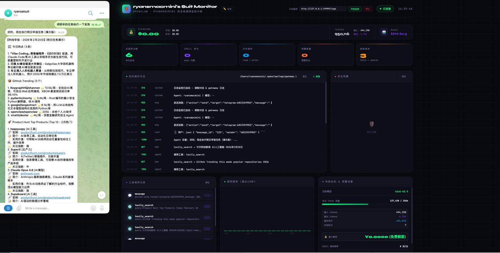
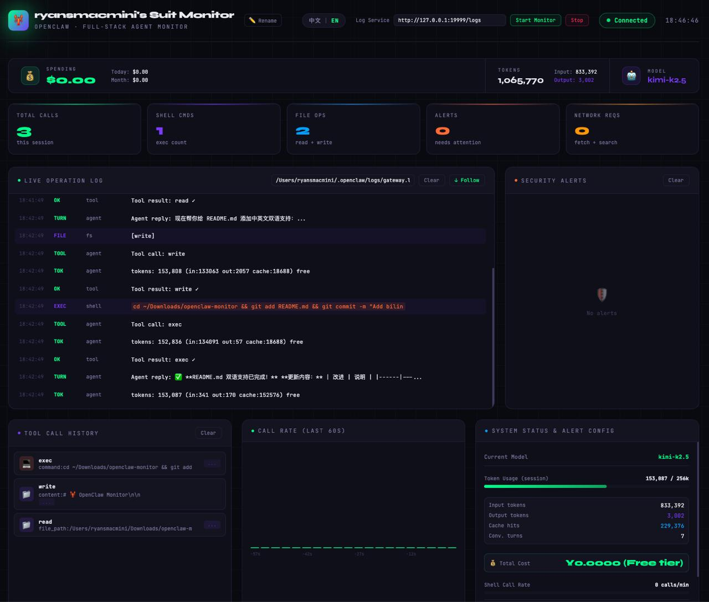

# 🦞 OpenClaw Monitor

<div align="center">

**[中文](#中文) | [English](#english)**

[](https://python.org)
[](LICENSE)
[](https://ryanmeg123.github.io/openclaw-monitor)

</div>

---

<a name="中文"></a>
## 🇨🇳 中文

### 简介

OpenClaw Gateway 实时监控面板 — 通过读取本地日志文件，实时显示 OpenClaw Agent 的工具调用、对话记录、token 用量等信息。

🔗 **在线预览**: https://ryanmeg123.github.io/openclaw-monitor

### 预览



### 功能特性

- **实时日志流** — 每3秒读取 `gateway.log`，显示 tavily 搜索、API 请求等
- **对话监控** — 每2秒读取 session JSONL，捕获工具调用、用户消息、Agent 回复
- **Token 用量** — 实时显示 token 消耗和成本
- **安全预警** — Shell 调用频率过高、危险命令、文件删除等自动报警
- **工具调用记录** — 可视化展示每次工具调用及结果
- **多语言支持** — 支持中文/英文切换界面

### 快速开始

#### 方式一：直接运行（推荐）

```bash
git clone https://github.com/RyanMeg123/openclaw-monitor.git
cd openclaw-monitor
python3 server.py
```

浏览器会自动打开 `http://127.0.0.1:19999`。

#### 方式二：安装为命令行工具

```bash
git clone https://github.com/RyanMeg123/openclaw-monitor.git
cd openclaw-monitor
pip3 install -e .

# 之后任何地方都可以运行：
openclaw-monitor
```

### 命令行参数

```
用法: python3 server.py [选项]

选项:
  --port, -p PORT         监听端口 (默认: 19999)
  --openclaw-dir, -d DIR  OpenClaw 数据目录 (默认自动检测)
  --no-open               不自动打开浏览器
  -h, --help              显示帮助

示例：

# 自定义端口
python3 server.py --port 8080

# 指定 OpenClaw 目录
python3 server.py --openclaw-dir /custom/path/.openclaw

# 不自动打开浏览器
python3 server.py --no-open
```

### 系统要求

- Python 3.7+
- macOS / Linux（Windows 需要 WSL）
- 已安装并运行 [OpenClaw](https://openclaw.ai)

### 目录结构

```
openclaw-monitor/
├── server.py          # 本地 HTTP 服务器（核心）
├── public/
│   └── index.html     # 监控面板前端（支持中英文）
├── bin/
│   └── openclaw-monitor  # 命令行入口脚本
├── setup.py           # pip 安装配置
└── README.md          # 本文件
```

### 工作原理

监控面板不使用 WebSocket（因为 OpenClaw Gateway 的 WebSocket 只允许一个 webchat 连接），而是通过本地 HTTP 服务器轮询读取文件：

- `GET /logs` → 读取 `~/.openclaw/logs/gateway.log` 最后200行
- `GET /session` → 读取 `~/.openclaw/agents/main/sessions/` 最新 JSONL 文件最后80行
- `GET /health` → 检查服务状态
- `GET /` → 提供监控面板 HTML

前端每2~3秒增量拉取新数据，只处理新增内容。

---

<a name="english"></a>
## 🇺🇸 English

### Introduction

OpenClaw Gateway real-time monitoring dashboard — displays OpenClaw Agent's tool calls, conversation records, token usage, and more by reading local log files.

🔗 **Live Demo**: https://ryanmeg123.github.io/openclaw-monitor

### Preview



### Features

- **Real-time Log Stream** — Reads `gateway.log` every 3 seconds, displays tavily searches, API requests, etc.
- **Conversation Monitor** — Reads session JSONL every 2 seconds, captures tool calls, user messages, Agent replies
- **Token Usage** — Real-time display of token consumption and costs
- **Security Alerts** — Automatic alerts for high-frequency Shell calls, dangerous commands, file deletions
- **Tool Call Records** — Visual display of each tool call and results
- **Multi-language Support** — Interface supports Chinese/English switching

### Quick Start

#### Method 1: Direct Run (Recommended)

```bash
git clone https://github.com/RyanMeg123/openclaw-monitor.git
cd openclaw-monitor
python3 server.py
```

The browser will automatically open `http://127.0.0.1:19999`.

#### Method 2: Install as CLI Tool

```bash
git clone https://github.com/RyanMeg123/openclaw-monitor.git
cd openclaw-monitor
pip3 install -e .

# Then run from anywhere:
openclaw-monitor
```

### Command Line Arguments

```
Usage: python3 server.py [options]

Options:
  --port, -p PORT         Listen port (default: 19999)
  --openclaw-dir, -d DIR  OpenClaw data directory (auto-detect by default)
  --no-open               Don't open browser automatically
  -h, --help              Show help

Examples:

# Custom port
python3 server.py --port 8080

# Specify OpenClaw directory
python3 server.py --openclaw-dir /custom/path/.openclaw

# Don't open browser
python3 server.py --no-open
```

### System Requirements

- Python 3.7+
- macOS / Linux (Windows requires WSL)
- [OpenClaw](https://openclaw.ai) installed and running

### Directory Structure

```
openclaw-monitor/
├── server.py          # Local HTTP server (core)
├── public/
│   └── index.html     # Dashboard frontend (bilingual)
├── bin/
│   └── openclaw-monitor  # CLI entry script
├── setup.py           # pip install config
└── README.md          # This file
```

### How It Works

The monitoring panel doesn't use WebSocket (because OpenClaw Gateway's WebSocket only allows one webchat connection), but instead polls files through a local HTTP server:

- `GET /logs` → Read last 200 lines of `~/.openclaw/logs/gateway.log`
- `GET /session` → Read last 80 lines of latest JSONL in `~/.openclaw/agents/main/sessions/`
- `GET /health` → Check service status
- `GET /` → Serve dashboard HTML

Frontend pulls new data incrementally every 2-3 seconds, only processing new content.

---

## 🛠️ Development Background

### 中文
在尝试直接连接 OpenClaw WebSocket Gateway 时，发现 Gateway 对每个客户端类型（webchat）只允许一个连接，导致监控面板和官方 webchat 互相踢掉对方。因此改用读取日志文件的方案，稳定可靠，不干扰正常使用。

### English
When trying to directly connect to OpenClaw WebSocket Gateway, we found that Gateway only allows one connection per client type (webchat), causing the monitoring panel and official webchat to kick each other out. Therefore, we switched to a log file reading solution, which is stable, reliable, and doesn't interfere with normal use.

---

## 📄 License / 许可证

MIT License - see [LICENSE](LICENSE) file for details.

---

<div align="center">

**Made with 🦞 by Ryan's Suit**

[Report Bug](https://github.com/RyanMeg123/openclaw-monitor/issues) · [Request Feature](https://github.com/RyanMeg123/openclaw-monitor/issues)

</div>